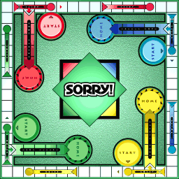

# Sorry - Monte Carlo Tree Search

This repository contains a C++ implementation of Monte Carlo Tree Search which plays the boardgame Sorry. Currently the agent only plays single player.

## Quality

After playing 10,000 games, average number of moves per game are:

- 62.06 - Making completely random (valid) moves
- 39.05 - Using MCTS with   30 iterations per game
- 37.91 - Using MCTS with   40 iterations per game
- 37.03 - Using MCTS with   50 iterations per game
- 34.67 - Using MCTS with  100 iterations per game
- 29.68 - Using MCTS with 1000 iterations per game